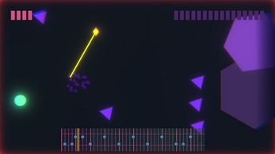
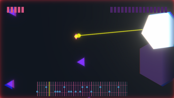
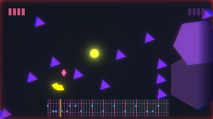
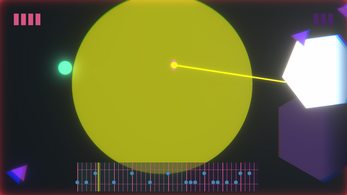

# Projeto Laserwave
## FP/L.EIC, 2021/22
## Marco André Pereira da Costa (up202108821)
## 1LEIC09

### Objetivo

1. Criar um clone do jogo [Laserwave](https://ambrits.itch.io/laserwave) em Pygame.

2. Partilhar algumas músicas específicas.

3. Organizar o meu primeiro projeto solo.

4. Tentar produzir todas as resources possíveis do projeto.

### Descrição

*---É um jogo de bullet-hell-like rhythmic shooter onde as tuas ações são definidas pela música. O objetivo do jogo é sobreviver o máximo de tempo e derrotar o máximo de inimigos.

Agarra o teu rato...

Aumenta o volume...

Sente o ritmo!---*

### UI

### Pacotes

- Pygame

### Tarefas

- Atualizado a última vez em 07/12/2021
